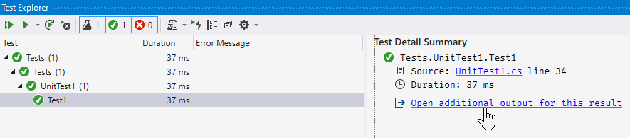
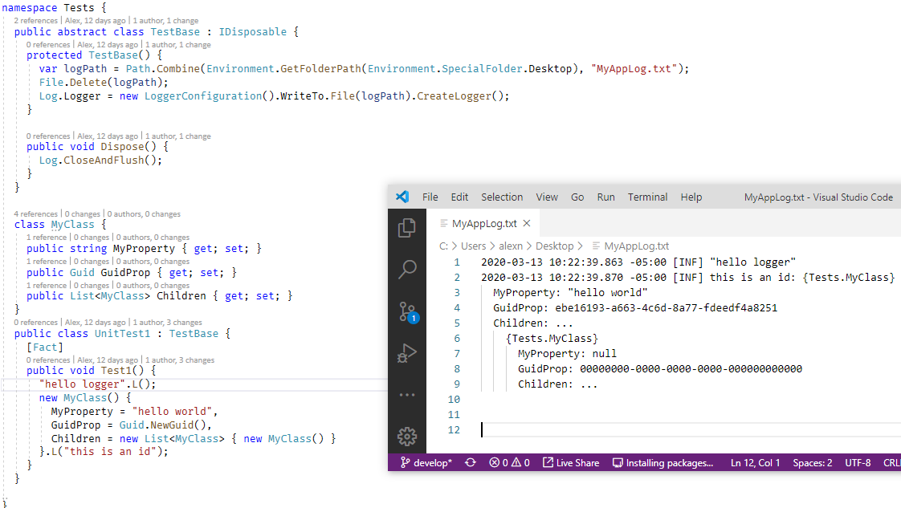

This is a project demoing how you can easily see the (console) output of a test, since standard Visual Studio behavior requires you to click on "Open additional output for this result" like some kind of keyboard shortcutless heathen:

The following screenshot shows how you can output the contents of a test to a file. When combined with an autoupdating text editor like VS Code, you merely have to alt tab over to look at the contents of the "console". NCrunch intelligently puts the console output right below the test, but unfortunately you have to pay for it. This currently doesn't scale well across multiple tests, as each run of a test will overwrite the previous test, but you can start to do things like use `CallerMemberNameAttribute` to create a unique log file for each test. To run the most recent test, click Test > Repeat Last Run. If the option is disabled, you need to make a change in your code and save.

